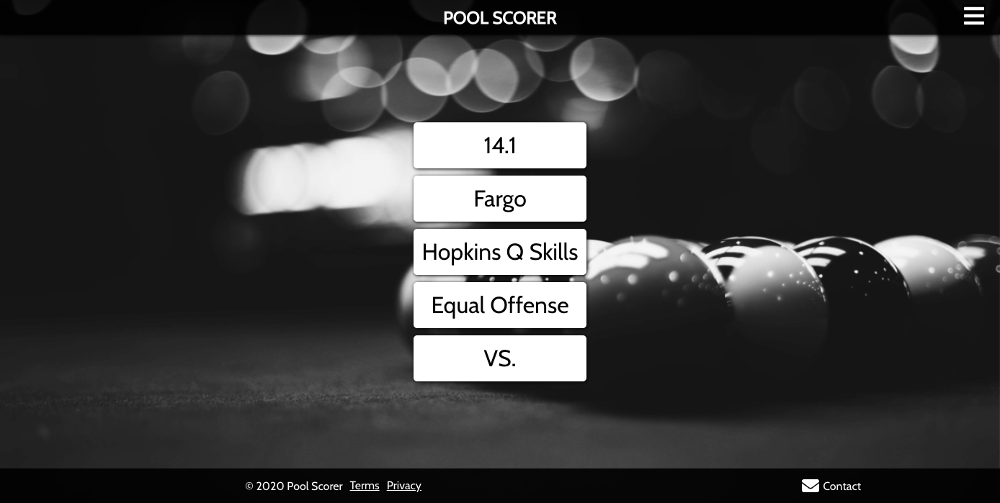

# Pool Scorer



Web app created using React to help keep score in a few different pool games.

[VISIT](https://poolscorer.com) Pool Scorer

## Setup

This project uses Firebase so you will need to create a firebase project and create a ```.env``` file with the following variables...

```javascript
REACT_APP_EMAIL_API= // this api route was created with firebase functions but you can use any email api
REACT_APP_API_KEY= // firebase config
REACT_APP_AUTH_DOMAIN= // firebase config
REACT_APP_DATABASE_URL= // firebase config
REACT_APP_PROJECT_ID= // firebase config
REACT_APP_STORAGE_BUCKET= // firebase config
REACT_APP_MESSAGING_SEND_ID= // firebase config
REACT_APP_APP_ID= // firebase config
REACT_APP_MEASUREMENT_ID= // firebase config
```

## Install

```bash
yarn install
```

## Start

```bash
yarn start
```

# Built With

* [React](https://reactjs.org/)
* [Styled-Components](https://styled-components.com/) (_styles_)
* [useContext](https://reactjs.org/docs/hooks-reference.html#usecontext) (_state management_)

## License

[MIT](https://choosealicense.com/licenses/mit/)
